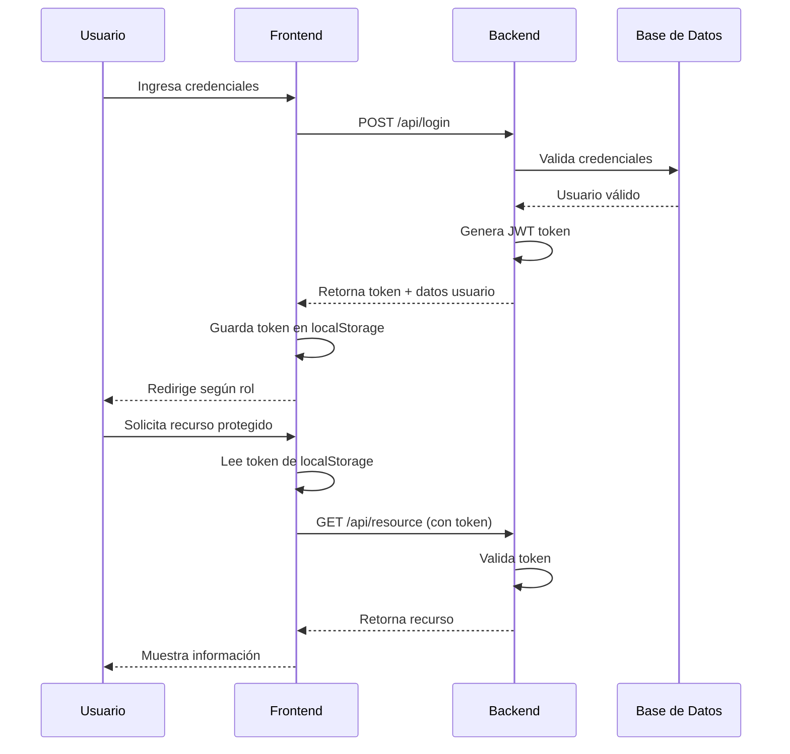

# 🎓 Sistema de Gestión de Cursos

<div align="center">


**Sistema completo de gestión académica con arquitectura moderna y escalable**

[Características](#-características-principales) •
[Instalación](#-instalación) •
[Documentación](#-documentación-de-la-api) •
[Arquitectura](#-arquitectura-del-proyecto) •
[Despliegue](#-despliegue-en-producción)

</div>

---

## 📋 Tabla de Contenidos

- [Descripción](#-descripción)
- [Características Principales](#-características-principales)
- [Tecnologías Utilizadas](#-tecnologías-utilizadas)
- [Requisitos Previos](#-requisitos-previos)
- [Arquitectura del Proyecto](#-arquitectura-del-proyecto)
- [Instalación](#-instalación)
  - [Backend (Laravel)](#1-backend-laravel)
  - [Frontend (Angular)](#2-frontend-angular)
- [Configuración](#-configuración)
- [Uso](#-uso)
- [Documentación de la API](#-documentación-de-la-api)
- [Sistema de Autenticación](#-sistema-de-autenticación)
- [Estructura de Rutas](#-estructura-de-rutas)
- [Seguridad](#-seguridad)
- [Testing](#-testing)
- [Despliegue](#-despliegue-en-producción)
- [Contribución](#-contribución)
- [Licencia](#-licencia)
- [Autor](#-autor)

---

## 📖 Descripción

Sistema de gestión académica desarrollado con **Laravel 9** (Backend API REST) y **Angular 19** (Frontend SPA), diseñado para facilitar la administración de usuarios, cursos y asignaciones estudiantiles. Implementa control de acceso basado en roles (**Administrador** y **Alumno**), autenticación segura mediante **JWT**, y una arquitectura modular que garantiza escalabilidad y mantenibilidad.

### 🎯 Objetivos del Proyecto

- Proporcionar una plataforma robusta para la gestión educativa
- Implementar autenticación y autorización seguras
- Ofrecer una experiencia de usuario fluida y responsive
- Garantizar código limpio, documentado y mantenible
- Facilitar la escalabilidad horizontal y vertical

---

## ✨ Características Principales

### 🔐 Autenticación y Seguridad
- Autenticación JWT con Laravel Sanctum
- Protección CSRF y validación de tokens
- Middleware de autorización por roles
- Guards y interceptores en Angular
- Encriptación de contraseñas con bcrypt

### 👥 Gestión de Usuarios
- CRUD completo de usuarios
- Roles diferenciados: `admin` y `alumno`
- Perfiles personalizables
- Validación de datos en tiempo real
- Sistema de permisos granular

### 📚 Gestión Académica
- Administración completa de cursos
- Asignación dinámica alumno-curso
- Panel de control intuitivo
- Visualización de cursos asignados
- Reportes y estadísticas

### ⚙️ Arquitectura Técnica
- API RESTful con arquitectura limpia
- Frontend modular con lazy loading
- Separación de responsabilidades (SoC)
- Inyección de dependencias
- Patrones de diseño (Repository, Service, Factory)

### 🎨 Experiencia de Usuario
- Interfaz responsive y moderna
- Feedback visual en operaciones
- Manejo inteligente de errores
- Carga optimizada de recursos
- Navegación fluida con SPA

---

## 🛠️ Tecnologías Utilizadas

### Backend
| Tecnología | Versión | Propósito |
|-----------|---------|-----------|
| **PHP** | 8.2+ | Lenguaje base |
| **Laravel** | 9.x | Framework backend |
| **Laravel Sanctum** | - | Autenticación JWT |
| **MySQL** | 8.x | Base de datos |
| **Composer** | 2.x | Gestión de dependencias |

### Frontend
| Tecnología | Versión | Propósito |
|-----------|---------|-----------|
| **TypeScript** | 5 | Lenguaje tipado |
| **Angular** | 19 | Framework frontend |
| **RxJS** | 7 | Programación reactiva |
| **Angular Router** | 19 | Navegación SPA |
| **Angular Material** | 19 | Componentes UI (opcional) |

### Herramientas de Desarrollo
- **Git** - Control de versiones
- **VS Code** - Editor recomendado
- **Postman** - Testing de API
- **Node.js** - Runtime JavaScript

---

## 📦 Requisitos Previos

Asegúrate de tener instaladas las siguientes herramientas antes de comenzar:

```bash
# Verificar versiones instaladas
php --version        # >= 8.2
composer --version   # >= 2
node --version       # >= 20
npm --version        # >= 10
ng version          # Angular CLI 19
mysql --version     # >= 8
git --version       # Última versión
```

### Requisitos del Sistema

- **Sistema Operativo**: Windows 10+, macOS 10.15+, o Linux (Ubuntu 20.04+)
- **RAM**: Mínimo 4GB (8GB recomendado)
- **Espacio en Disco**: 2GB libres
- **Conexión a Internet**: Para instalación de dependencias

---

## 🏗️ Arquitectura del Proyecto

```
scooters_CRUD/
│
├── backend/                          # Laravel 9 - API REST
│   ├── app/
│   │   ├── Http/
│   │   │   ├── Controllers/          # Controladores de la API
│   │   │   │   ├── AuthController.php
│   │   │   │   ├── UserController.php
│   │   │   │   ├── CourseController.php
│   │   │   │   └── AssignmentController.php
│   │   │   ├── Middleware/           # Middleware personalizado
│   │   │   │   └── CheckRole.php
│   │   │   └── Requests/             # Form Requests
│   │   │       ├── LoginRequest.php
│   │   │       ├── RegisterRequest.php
│   │   │       └── CourseRequest.php
│   │   ├── Models/                   # Modelos Eloquent
│   │   │   ├── User.php
│   │   │   ├── Course.php
│   │   │   └── Assignment.php
│   │   └── Services/                 # Lógica de negocio
│   │       ├── AuthService.php
│   │       ├── UserService.php
│   │       └── CourseService.php
│   ├── config/                       # Configuración
│   │   ├── sanctum.php
│   │   ├── cors.php
│   │   └── database.php
│   ├── database/
│   │   ├── migrations/               # Migraciones
│   │   └── seeders/                  # Seeders iniciales
│   │       └── DatabaseSeeder.php
│   ├── routes/
│   │   └── api.php                   # Rutas de la API
│   ├── .env.example                  # Plantilla de configuración
│   └── composer.json                 # Dependencias PHP
│
└── frontend/                         # Angular 19 - SPA
    ├── src/
    │   ├── app/
    │   │   ├── core/                 # Servicios principales
    │   │   │   ├── services/
    │   │   │   │   ├── auth.service.ts
    │   │   │   │   ├── user.service.ts
    │   │   │   │   └── course.service.ts
    │   │   │   ├── guards/
    │   │   │   │   ├── auth.guard.ts
    │   │   │   │   └── role.guard.ts
    │   │   │   ├── interceptors/
    │   │   │   │   └── auth.interceptor.ts
    │   │   │   └── models/           # Interfaces TypeScript
    │   │   │       ├── user.model.ts
    │   │   │       ├── course.model.ts
    │   │   │       └── assignment.model.ts
    │   │   ├── features/             # Módulos funcionales
    │   │   │   ├── auth/
    │   │   │   │   ├── login/
    │   │   │   │   └── register/
    │   │   │   ├── admin/
    │   │   │   │   ├── dashboard/
    │   │   │   │   ├── users/
    │   │   │   │   ├── courses/
    │   │   │   │   └── assignments/
    │   │   │   └── student/
    │   │   │       └── my-courses/
    │   │   ├── shared/               # Componentes compartidos
    │   │   │   ├── navbar/
    │   │   │   ├── loader/
    │   │   │   ├── modal/
    │   │   │   └── toast/
    │   │   └── app.routes.ts         # Configuración de rutas
    │   ├── environments/             # Variables de entorno
    │   │   ├── environment.ts
    │   │   └── environment.development.ts
    │   ├── assets/                   # Recursos estáticos
    │   └── index.html
    ├── angular.json                  # Configuración Angular
    ├── package.json                  # Dependencias Node
    └── tsconfig.json                 # Configuración TypeScript
```

### 📐 Patrones de Diseño Implementados

- **MVC** - Modelo Vista Controlador (Laravel)
- **Repository Pattern** - Abstracción de datos
- **Service Layer** - Lógica de negocio separada
- **Dependency Injection** - Inversión de control
- **Observer Pattern** - RxJS Observables
- **Guard Pattern** - Protección de rutas
- **Interceptor Pattern** - HTTP middleware

---

## 🚀 Instalación

### 1. Backend (Laravel)

#### Clonar el Repositorio

```bash
git clone https://github.com/IngHermesCastro/scooters_CRUD.git
cd scooters_CRUD/backend
```

#### Instalar Dependencias

```bash
composer install
```

#### Configurar Variables de Entorno

```bash
cp .env.example .env
```

Edita el archivo `.env` con tus credenciales:

```env
# Configuración General
APP_NAME="Sistema de Gestión de Cursos"
APP_ENV=local
APP_KEY=
APP_DEBUG=true
APP_URL=http://localhost:8000
APP_TIMEZONE=UTC
APP_LOCALE=es

# Base de Datos
DB_CONNECTION=mysql
DB_HOST=127.0.0.1
DB_PORT=3306
DB_DATABASE=cursos_db
DB_USERNAME=root
DB_PASSWORD=

# Laravel Sanctum
SANCTUM_STATEFUL_DOMAINS=localhost:4200
SESSION_DOMAIN=localhost

# CORS
CORS_ALLOWED_ORIGINS=http://localhost:4200
```

#### Generar Clave de Aplicación

```bash
php artisan key:generate
```

#### Crear Base de Datos

```bash
# Accede a MySQL
mysql -u root -p

# Crea la base de datos
CREATE DATABASE cursos_db CHARACTER SET utf8mb4 COLLATE utf8mb4_unicode_ci;
EXIT;
```

#### Ejecutar Migraciones y Seeders

```bash
php artisan migrate --seed
```

**Datos de prueba creados:**
- **Roles**: `admin`, `alumno`
- **Usuario Administrador**:
  - Email: `admin@cursos.com`
  - Password: `password`

#### Iniciar Servidor de Desarrollo

```bash
php artisan serve
```

✅ **Backend disponible en**: `http://localhost:8000`

---

### 2. Frontend (Angular)

#### Navegar al Directorio Frontend

```bash
cd ../frontend
```

#### Instalar Dependencias

```bash
npm install
```

#### Configurar Entornos

**Desarrollo** - `src/environments/environment.development.ts`:

```typescript
export const environment = {
  production: false,
  apiUrl: 'http://localhost:8000/api',
  appName: 'Sistema de Gestión de Cursos',
  tokenKey: 'auth_token',
  userKey: 'current_user',
  apiTimeout: 30000
};
```

**Producción** - `src/environments/environment.ts`:

```typescript
export const environment = {
  production: true,
  apiUrl: 'https://mi-dominio.com/api',
  appName: 'Sistema de Gestión de Cursos',
  tokenKey: 'auth_token',
  userKey: 'current_user',
  apiTimeout: 30000
};
```

#### Iniciar Servidor de Desarrollo

```bash
ng serve
```

✅ **Frontend disponible en**: `http://localhost:4200`

---

## ⚙️ Configuración

### Configuración de CORS (Laravel)

Edita `config/cors.php`:

```php
return [
    'paths' => ['api/*', 'sanctum/csrf-cookie'],
    'allowed_methods' => ['*'],
    'allowed_origins' => [env('CORS_ALLOWED_ORIGINS', 'http://localhost:4200')],
    'allowed_origins_patterns' => [],
    'allowed_headers' => ['*'],
    'exposed_headers' => [],
    'max_age' => 0,
    'supports_credentials' => true,
];
```

### Configuración de Sanctum

Edita `config/sanctum.php`:

```php
'stateful' => explode(',', env('SANCTUM_STATEFUL_DOMAINS', 'localhost:4200')),

'expiration' => 60 * 24, // 24 horas
```

---

## 📘 Uso

### 1. Acceso al Sistema

1. Abre tu navegador en `http://localhost:4200`
2. Inicia sesión con las credenciales del administrador:
   - **Email**: `admin@example.com`
   - **Password**: `1234567`

### 2. Panel de Administrador

- **Dashboard**: Vista general del sistema
- **Usuarios**: Crear, editar, eliminar usuarios
- **Cursos**: Gestión completa de cursos
- **Asignaciones**: Asignar cursos a alumnos

### 3. Panel de Alumno

- **Mis Cursos**: Visualización de cursos asignados
- **Perfil**: Información personal

---

## 📚 Documentación de la API

### Base URL
```
http://localhost:8000/api
```

### Headers Requeridos

```http
Content-Type: application/json
Accept: application/json
Authorization: Bearer {token}  # Para rutas protegidas
```

### Endpoints Disponibles

#### 🔓 Autenticación (Públicos)

##### Registro de Usuario
```http
POST /api/register
```

**Body:**
```json
{
  "name": "Juan Pérez",
  "email": "juan@example.com",
  "password": "password123",
  "password_confirmation": "password123",
  "role": "alumno"
}
```

**Response (201):**
```json
{
  "message": "Usuario registrado exitosamente",
  "user": {
    "id": 1,
    "name": "Juan Pérez",
    "email": "juan@example.com",
    "role": "alumno"
  },
  "token": "1|eyJ0eXAiOiJKV1QiLCJhbGc..."
}
```

##### Inicio de Sesión
```http
POST /api/login
```

**Body:**
```json
{
  "email": "admin@cursos.com",
  "password": "password"
}
```

**Response (200):**
```json
{
  "message": "Inicio de sesión exitoso",
  "user": {
    "id": 1,
    "name": "Administrador",
    "email": "admin@cursos.com",
    "role": "admin"
  },
  "token": "2|eyJ0eXAiOiJKV1QiLCJhbGc..."
}
```

---

#### 🔐 Usuarios (Requiere autenticación)

##### Listar Usuarios
```http
GET /api/users
Authorization: Bearer {token}
Role: admin
```

**Response (200):**
```json
{
  "data": [
    {
      "id": 1,
      "name": "Administrador",
      "email": "admin@cursos.com",
      "role": "admin",
      "created_at": "2025-01-15T10:30:00.000000Z"
    }
  ],
  "meta": {
    "current_page": 1,
    "total": 10
  }
}
```

##### Crear Usuario
```http
POST /api/users
Authorization: Bearer {token}
Role: admin
```

**Body:**
```json
{
  "name": "María García",
  "email": "maria@example.com",
  "password": "123456",
  "role": "alumno"
}
```

##### Actualizar Usuario
```http
PUT /api/users/{id}
Authorization: Bearer {token}
Role: admin
```

##### Eliminar Usuario
```http
DELETE /api/users/{id}
Authorization: Bearer {token}
Role: admin
```

---

#### 📚 Cursos

##### Listar Cursos
```http
GET /api/courses
Authorization: Bearer {token}
```

**Response (200):**
```json
{
  "data": [
    {
      "id": 1,
      "title": "Desarrollo Web con Laravel",
      "description": "Curso completo de Laravel 9",
      "duration_hours": 40,
      "instructor": "Prof. Hermes Castro",
      "created_at": "2025-01-10T08:00:00.000000Z"
    }
  ]
}
```

##### Crear Curso
```http
POST /api/courses
Authorization: Bearer {token}
Role: admin
```

**Body:**
```json
{
  "title": "Angular Avanzado",
  "description": "Desarrollo de aplicaciones enterprise",
  "duration_hours": 50,
  "instructor": "Prof. Ana Martínez"
}
```

##### Actualizar Curso
```http
PUT /api/courses/{id}
Authorization: Bearer {token}
Role: admin
```

##### Eliminar Curso
```http
DELETE /api/courses/{id}
Authorization: Bearer {token}
Role: admin
```

---

#### 🎯 Asignaciones

##### Asignar Curso a Alumno
```http
POST /api/assignments
Authorization: Bearer {token}
Role: admin
```

**Body:**
```json
{
  "user_id": 5,
  "course_id": 2
}
```

##### Mis Cursos (Alumno)
```http
GET /api/my-courses
Authorization: Bearer {token}
Role: alumno
```

---

### Códigos de Estado HTTP

| Código | Significado |
|--------|-------------|
| `200` | Operación exitosa |
| `201` | Recurso creado |
| `204` | Eliminación exitosa |
| `400` | Solicitud incorrecta |
| `401` | No autenticado |
| `403` | Acceso denegado |
| `404` | Recurso no encontrado |
| `422` | Error de validación |
| `500` | Error del servidor |

---

## 🔐 Sistema de Autenticación

### Flujo de Autenticación



### Protección de Rutas Frontend

```typescript
// auth.guard.ts
export const authGuard: CanActivateFn = (route, state) => {
  const authService = inject(AuthService);
  const router = inject(Router);
  
  if (authService.isAuthenticated()) {
    return true;
  }
  
  router.navigate(['/login']);
  return false;
};

// role.guard.ts
export const roleGuard: CanActivateFn = (route, state) => {
  const authService = inject(AuthService);
  const router = inject(Router);
  const expectedRole = route.data['role'];
  
  if (authService.hasRole(expectedRole)) {
    return true;
  }
  
  router.navigate(['/unauthorized']);
  return false;
};
```

### Middleware Backend

```php
// CheckRole.php
public function handle(Request $request, Closure $next, string $role): Response
{
    if (!$request->user() || $request->user()->role !== $role) {
        return response()->json([
            'message' => 'Acceso denegado'
        ], 403);
    }
    
    return $next($request);
}
```

---

## 🗺️ Estructura de Rutas

### Frontend (Angular)

```typescript
export const routes: Routes = [
  { path: '', redirectTo: '/login', pathMatch: 'full' },
  
  // Rutas públicas
  {
    path: 'login',
    loadComponent: () => import('./features/auth/login/login.component')
  },
  
  // Rutas de administrador
  {
    path: 'admin',
    canActivate: [authGuard, roleGuard],
    data: { role: 'admin' },
    children: [
      {
        path: 'dashboard',
        loadComponent: () => import('./features/admin/dashboard/dashboard.component')
      },
      {
        path: 'users',
        loadComponent: () => import('./features/admin/users/users.component')
      },
      {
        path: 'courses',
        loadComponent: () => import('./features/admin/courses/courses.component')
      }
    ]
  },
  
  // Rutas de alumno
  {
    path: 'student',
    canActivate: [authGuard, roleGuard],
    data: { role: 'alumno' },
    children: [
      {
        path: 'my-courses',
        loadComponent: () => import('./features/student/my-courses/my-courses.component')
      }
    ]
  }
];
```

### Backend (Laravel)

```php
// routes/api.php
Route::post('/register', [AuthController::class, 'register']);
Route::post('/login', [AuthController::class, 'login']);

Route::middleware(['auth:sanctum'])->group(function () {
    Route::post('/logout', [AuthController::class, 'logout']);
    Route::get('/user', [AuthController::class, 'user']);
    
    // Rutas de administrador
    Route::middleware(['role:admin'])->group(function () {
        Route::apiResource('users', UserController::class);
        Route::apiResource('courses', CourseController::class);
        Route::post('assignments', [AssignmentController::class, 'assign']);
    });
    
    // Rutas comunes
    Route::get('courses', [CourseController::class, 'index']);
    Route::get('my-courses', [AssignmentController::class, 'myCourses']);
});
```

---

## 🔒 Seguridad

### Medidas Implementadas

#### Backend
- ✅ Autenticación JWT con Laravel Sanctum
- ✅ Protección CSRF
- ✅ Validación de datos con Form Requests
- ✅ Sanitización de entradas
- ✅ Rate limiting en API
- ✅ Encriptación de contraseñas (bcrypt)
- ✅ Middleware de autorización por roles
- ✅ Headers de seguridad configurados
- ✅ CORS configurado apropiadamente

#### Frontend
- ✅ Guards de autenticación y roles
- ✅ Interceptores HTTP automáticos
- ✅ Sanitización de HTML
- ✅ Validación de formularios
- ✅ Manejo seguro de tokens
- ✅ Timeout de sesión
- ✅ Protección contra XSS

### Recomendaciones Adicionales

```env
# Producción - .env
APP_DEBUG=false
APP_ENV=production

# Cambiar clave de aplicación
php artisan key:generate

# Usar HTTPS
APP_URL=https://tu-dominio.com

# Configurar rate limiting
THROTTLE_LIMIT=60
```

---

## 🧪 Testing

### Backend (PHPUnit)

```bash
# Ejecutar todos los tests
php artisan test

# Test con cobertura
php artisan test --coverage

# Test específico
php artisan test --filter AuthTest
```

**Ejemplo de test:**

```php
// tests/Feature/AuthTest.php
public function test_user_can_login_with_valid_credentials()
{
    $user = User::factory()->create([
        'password' => bcrypt('password123')
    ]);
    
    $response = $this->postJson('/api/login', [
        'email' => $user->email,
        'password' => 'password123'
    ]);
    
    $response->assertStatus(200)
             ->assertJsonStructure(['token', 'user']);
}
```

### Frontend (Jasmine/Karma)

```bash
# Ejecutar tests unitarios
ng test

# Tests con cobertura
ng test --code-coverage

# Tests E2E
ng e2e
```

---

## 🚢 Despliegue en Producción

### 1. Backend (Laravel)

#### En Servidor (VPS/Dedicado)

```bash
# 1. Clonar repositorio
git clone https://github.com/IngHermesCastro/scooters_CRUD.git
cd scooters_CRUD/backend

# 2. Instalar dependencias de producción
composer install --optimize-autoloader --no-dev

# 3. Configurar .env
cp .env.example .env
nano .env  # Editar configuración

# 4. Generar clave
php artisan key:generate

# 5. Cachear configuración
php artisan config:cache
php artisan route:cache
php artisan view:cache

# 6. Migrar base de datos
php artisan migrate --force

# 7. Configurar permisos
chmod -R 775 storage bootstrap/cache
chown -R www-data:www-data storage bootstrap/cache
```

#### Configuración de Nginx

```nginx
server {
    listen 80;
    server_name api.tu-dominio.com;
    root /var/www/backend/public;

    add_header X-Frame-Options "SAMEORIGIN";
    add_header X-Content-Type-Options "nosniff";

    index index.php;

    charset utf-8;

    location / {
        try_files $uri $uri/ /index.php?$query_string;
    }

    location = /favicon.ico { access_log off; log_not_found off; }
    location = /robots.txt  { access_log off; log_not_found off; }

    error_page 404 /index.php;

    location ~ \.php$ {
        fastcgi_pass unix:/var/run/php/php8.2-fpm.sock;
        fastcgi_param SCRIPT_FILENAME $realpath_root$fastcgi_script_name;
        include fastcgi_params;
    }

    location ~ /\.(?!well-known).* {
        deny all;
    }
}
```

---

### 2. Frontend (Angular)

```bash
# 1. Compilar para producción
ng build --configuration production

# 2. El contenido estará en dist/frontend/
# Copiar al servidor web
scp -r dist/frontend/* usuario@servidor:/var/www/html/
```

#### Configuración de Nginx para SPA

```nginx
server {
    listen 80;
    server_name tu-dominio.com;
    root /var/www/html;

    index index.html;

    location / {
        try_files $uri $uri/ /index.html;
    }

    # Cache de assets
    location ~* \.(js|css|png|jpg|jpeg|gif|ico|svg)$ {
        expires 1y;
        add_header Cache-Control "public, immutable";
    }
}
```

---

### 3. SSL con Let's Encrypt

```bash
# Instalar Certbot
sudo apt install certbot python3-certbot-nginx

# Obtener certificado
sudo certbot --nginx -d tu-dominio.com -d www.tu-dominio.com
sudo certbot --nginx -d api.tu-dominio.com

# Renovación automática
sudo certbot renew --dry-run
```

---

## 🤝 Contribución

¡Las contribuciones son bienvenidas! Sigue estos pasos:

### 1. Fork del Proyecto

```bash
# Fork desde GitHub, luego:
